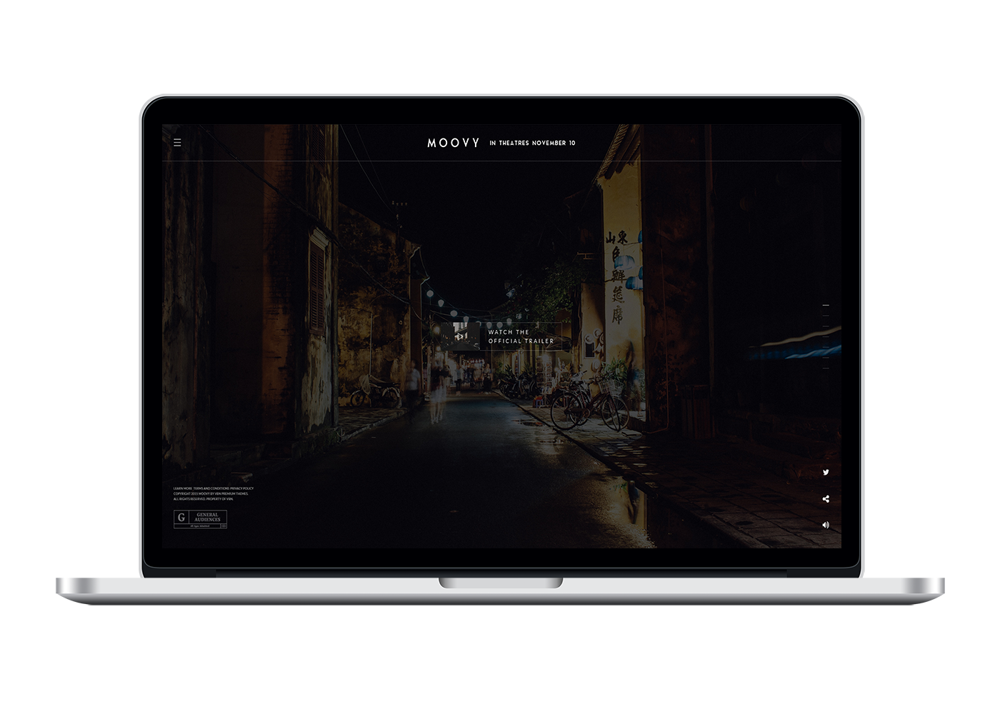

# MOOVY — Responsive HTML5 Template

http://rogatnev-nikita.github.io/moovy/html/

<h4>Summary</h4>
<ul>
  <li>High Resolution: Yes</li>
  <li>Compatible Browsers: IE10, Firefox, Safari, Opera, Chrome, Edge</li>
  <li>Files Included: HTML Files, CSS Files, JS Files, PHP Files</li>
  <li>Columns: 12</li>
  <li>Documentation: Well Documented</li>
  <li>Layout: Responsive</li>
  <li>Category: Entertainment / Film & TVs</li>
  <li>Tags: bootstrap, entertainment, film, movie, trailer, video, showcase, tv, clean, darks</li>
</ul>

<h4>File structure</h4>
    ROOT FOLDER
    +-- scripts /
    ¦  +-- jquery.js
    ¦  +-- main.js
    ¦  +-- onepage-scroll.min.js
    +-- styles /
    ¦    +-- main.css
    ¦    +-- onepage-scroll.css
    +-- fonts /
    ¦    +-- aqua /
    ¦        ¦-- aqua.woff
    ¦        ¦-- aqua.woff2
    +-- images /
    ¦    +-- all images
    +-- 404.html
    +-- crew.html
    +-- gallery.html
    +-- index.html
    +-- news.html
    +-- synopsis.html
    +-- video.html

<h4>Sources & Credits</h4>
<ul>
  <li>
    <strong>Font Awesome</strong> font-awesome.min.css v4.5.0
      Copyright © Dave Gandy
      Licensed under MIT (<a href="http://fontawesome.io/license/" target="_blank">http://fontawesome.io/license/</a>)
  </li>
  <li>
    <strong>jQuery</strong> jquery.js v2.1.4
      Licensed under MIT (<a href="https://jquery.org/license/" target="_blank">https://jquery.org/license/</a>)
  </li>
  <li>
    <strong>Bootstrap</strong> bootstrap.min.js v3.3.6
     bootstrap.min.css v3.3.6
      Licensed under MIT (<a href="https://github.com/twbs/bootstrap/blob/master/LICENSE" target="_blank">https://github.com/twbs/bootstrap/blob/master/LICENSE</a>)
  </li>
</ul>
